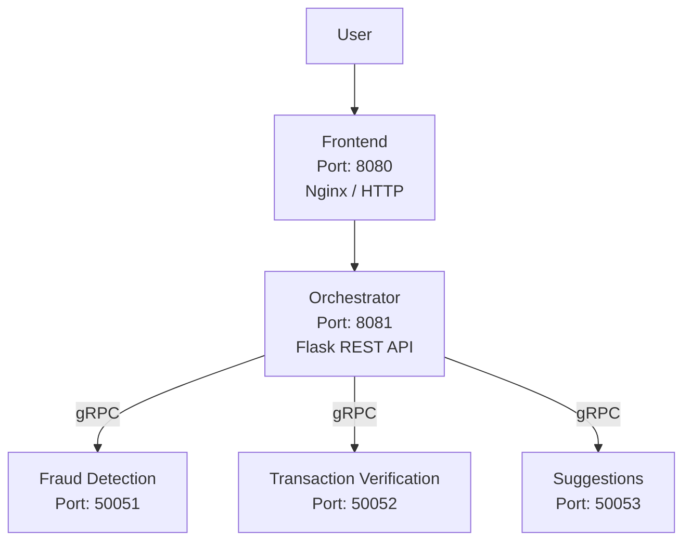
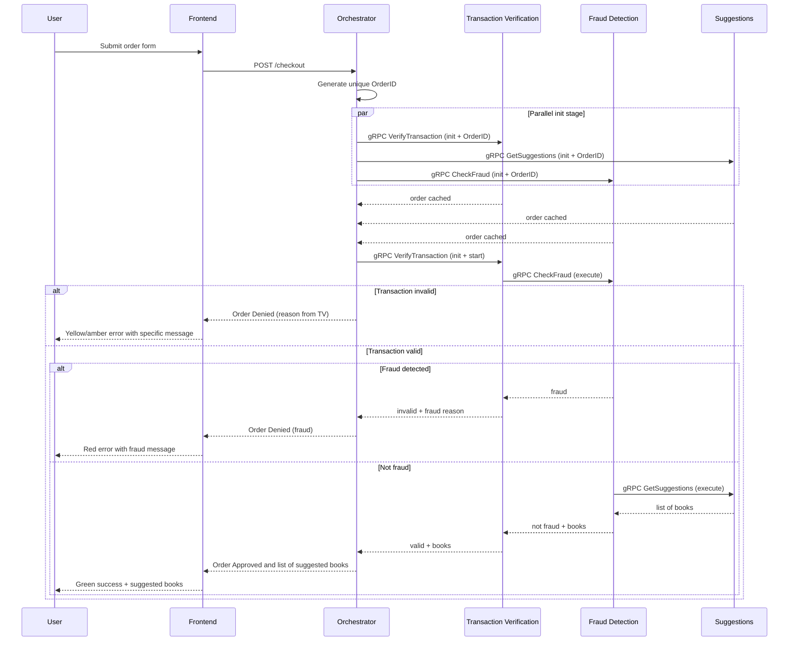

# Distributed Bookstore System

Distributed Systems course project @ University of Tartu — an online bookstore checkout system built with a microservices architecture.

The frontend sends checkout requests to an orchestrator, which coordinates transaction verification, fraud detection, and book suggestions via gRPC.

## Architecture



All backend services run in Docker containers. The orchestrator now sends `initOrder`-style RPCs to all three gRPC services at the start so they cache the order and initialize per-order vector clocks. The transaction-verification init call also starts the processing chain, and from there the backend services communicate directly over gRPC in the order transaction verification -> fraud detection -> suggestions.

## Event Partial Order And Vector Clocks

The checkout flow now uses an init-driven protocol. The orchestrator first generates a unique `OrderID`, sends that ID to every backend service, and each service caches the order plus initializes a per-order vector clock. The transaction-verification init call then continues directly into the backend execution chain.

Events used in the flow:

- `a`: orchestrator receives the checkout request
- `b`: orchestrator creates a unique `OrderID`
- `c`: transaction-verification service caches the order
- `d`: suggestions service caches the order
- `e`: fraud-detection service caches the order
- `f`: transaction-verification service executes validation from cached state
- `g`: fraud-detection service executes after verification succeeds
- `h`: suggestions service generates recommendations after fraud detection passes
- `i`: orchestrator finalizes the checkout response

Partial order:

- `a < b`
- `b < c`, `b < d`, `b < e`
- `c`, `d`, and `e` can happen in parallel
- `c < f`
- `e < g`
- `d < h`
- `f < g < h`
- `i` depends on `h` for successful orders

The `/checkout` response includes:

- `orderId`: the generated unique order identifier
- `vectorClock`: the final merged vector clock
- `eventTrace`: the ordered list of recorded events with their vector clocks

RPC layout:

- Transaction verification: `InitializeVerificationOrder`
- Suggestions: `InitializeSuggestionsOrder`
- Fraud detection: `InitializeFraudOrder`

Failure handling:

- Initialization failures are returned to the orchestrator immediately
- Verification failures short-circuit the flow before fraud detection
- Only fully successful executions propagate suggested books back to the user

## Services

| Service | Port | Protocol | Description |
|---------|------|----------|-------------|
| **Frontend** | 8080 | HTTP (Nginx) | Static HTML/JS checkout form served by Nginx |
| **Orchestrator** | 8081 | REST (Flask) | Receives checkout requests, coordinates gRPC calls |
| **Fraud Detection** | 50051 | gRPC | AI-powered fraud analysis using Google Gen AI (Gemma 3 27B) |
| **Transaction Verification** | 50052 | gRPC | Validates email, card number, CVV, expiration date, and billing address |
| **Suggestions** | 50053 | gRPC | AI-generated book recommendations based on purchased items |

## System diagram



## Validation Rules (Transaction Verification)

| Field | Rule |
|-------|------|
| Email | Must match `[^@]+@[^@]+\.[^@]+` |
| Card number | Exactly 16 digits |
| CVV | 3 or 4 digits |
| Expiration date | Format `MM/YY`, must not be expired (year/month comparison) |
| Billing street | At least 5 characters |
| Billing city | At least 2 characters |
| Billing state | Alphabetic characters only |
| Billing ZIP | Exactly 5 digits |
| Billing country | At least 2 characters |

## Fraud Detection Rules

Fraud detection is now powered by AI using Google Gen AI (Gemma 3 27B model). The AI analyzes the card number and order amount to determine if a transaction is fraudulent. Previous rule-based checks (amount > 1000 or card prefix "999") have been replaced with intelligent analysis.

## How to Run

### Setting up Google AI API Key

The `fraud_detection` and `suggestions` services use Google's Gen AI API with the Gemma 3 27B model. You need a Google AI API key:

1. Visit [Google AI Studio](https://aistudio.google.com/apikey) to generate an API key.
2. Set the `GOOGLE_API_KEY` environment variable before running the services.

**Option 1: Export in terminal (recommended for development)**
```bash
export GOOGLE_API_KEY=your_actual_api_key_here
docker compose up --build
```

**Option 2: Add to docker-compose.yaml**
Add the following to the `environment` section of `fraud_detection` and `suggestions` services:
```yaml
- GOOGLE_API_KEY=your_actual_api_key_here
```

**Option 3: Use a .env file**
Create a `.env` file in the project root:
```
GOOGLE_API_KEY=your_actual_api_key_here
```
Then update `docker-compose.yaml` to include `env_file: - .env` for both services.

**Note:** Never commit API keys to version control. Use `.gitignore` for `.env` files.

### Running the Application

```bash
docker compose up --build
```

The frontend will be available at [http://localhost:8080](http://localhost:8080).

Services are configured in `docker-compose.yaml`. Code changes are hot-reloaded automatically — no restart needed during development.

### Running locally (alternative)

- Python 3.8+, pip, [grpcio-tools](https://grpc.io/docs/languages/python/quickstart/)
- Install each service's `requirements.txt`
- Frontend: open `frontend/src/index.html` in a browser

## Project Structure

```
frontend/          Static HTML/JS checkout page (served by Nginx)
orchestrator/      Flask REST API — coordinates the checkout pipeline
fraud_detection/   gRPC service — fraud rule checks
transaction_verification/  gRPC service — field validation
suggestions/       gRPC service — book recommendations
utils/             Shared protobuf definitions and helper scripts
docs/              Documentation and project plans
```

## Known Limitations

- Suggestions are now AI-generated but may not always be contextually accurate
- Order amount for fraud detection is based on item quantity sum, not actual prices
- Item list is hardcoded in the frontend (Book A, Book B)
- Only 5 digits zip codes are supported for billing address
- The orchestrator assigns a static order ID ("12345")
