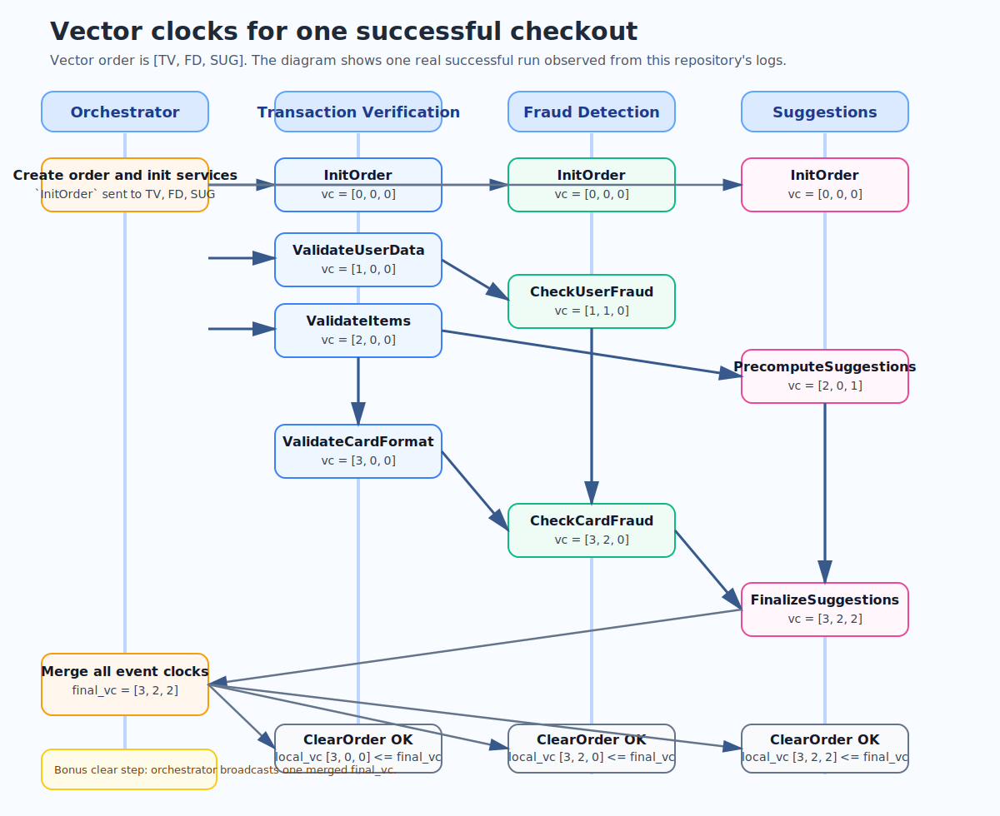
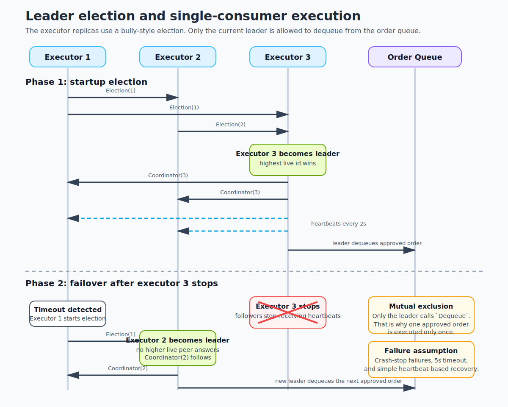
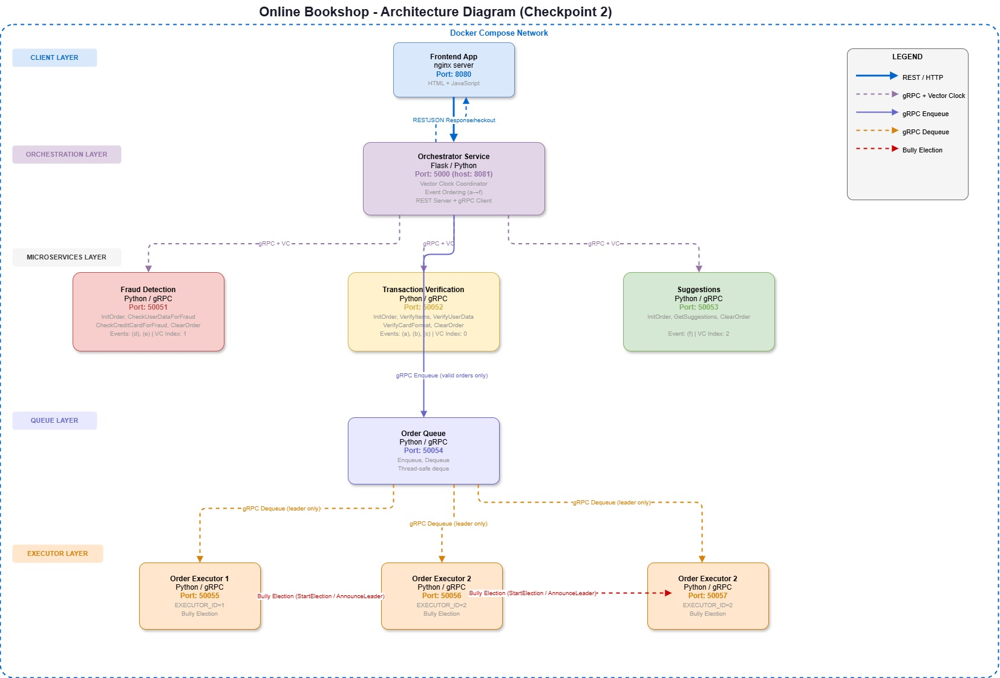
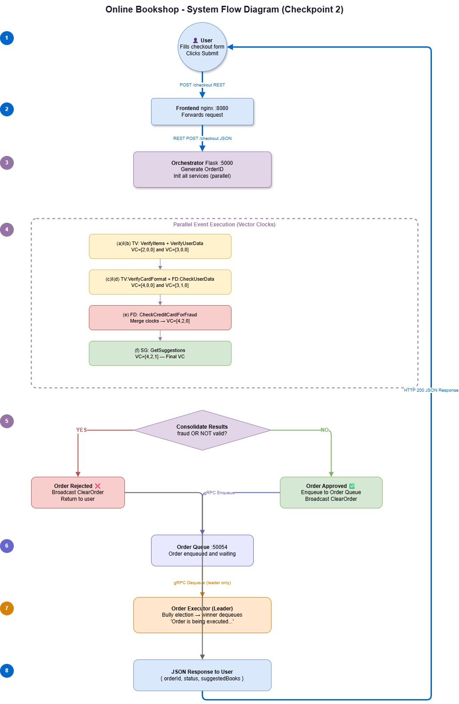

# Distributed Systems Practice Project - Checkpoint 2

## How to demonstrate that this repository works
This section is intentionally first so it can be used as a short live-demo checklist.

1. Start Docker Desktop, then start the full stack from the repository root.

```powershell
docker compose up --build -d
docker compose ps
```

Expected result: all 9 services are up (`frontend`, `orchestrator`, the 3 backend services, `order_queue`, and the 3 executor replicas).

2. Run the reusable Checkpoint 2 verification script.

```powershell
.\scripts\checkpoint2-checks.ps1
```

After the first full build, the quicker rerun is:

```powershell
.\scripts\checkpoint2-checks.ps1 -SkipBuild
```

Expected result: all implementation-based checks pass, including valid checkout, rejection cases, vector-clock log checks, queue/executor checks, and leader failover.

3. If the teaching assistants want a manual happy-path demo, open the frontend at `http://127.0.0.1:8080` and submit a normal order. The REST API is also available at `http://127.0.0.1:8081`.

4. If they want manual API testing, use the prepared payload files in the repo:

```powershell
Invoke-WebRequest `
  -Uri http://127.0.0.1:8081/checkout `
  -Method POST `
  -ContentType "application/json" `
  -Body (Get-Content .\test_checkout.json -Raw)
```

Swap in `test_checkout_fraud.json`, `test_checkout_empty_items.json`, and `test_checkout_terms_false.json` to show rejection paths.

5. Show the logs that prove the distributed behavior:

```powershell
docker compose logs --no-color --tail 200 orchestrator transaction_verification fraud_detection suggestions
docker compose logs --no-color --tail 200 order_queue order_executor_1 order_executor_2 order_executor_3
```

Point out:
- `vc=[...]` in the 3 backend services
- `clear_broadcast_sent final_vc=[...]` in the orchestrator
- `action=enqueue` and `action=dequeue` in the queue
- `executing order=` in exactly one executor replica

6. Show the leader-election bonus by either rerunning the script or doing a quick manual failover:

```powershell
docker compose stop order_executor_3
Invoke-WebRequest `
  -Uri http://127.0.0.1:8081/checkout `
  -Method POST `
  -ContentType "application/json" `
  -Body (Get-Content .\test_checkout.json -Raw)
docker compose logs --no-color --since 30s order_queue order_executor_1 order_executor_2 order_executor_3
docker compose up -d order_executor_3
```

Expected result: another executor becomes leader after timeout, dequeues the next approved order, and execution still happens exactly once.

7. Stop the stack when the demo is over.

```powershell
docker compose down
```

## Checkpoint 2 deliverables in this repo
This repository now contains the implementation and documentation required for Checkpoint 2:

- vector clocks across `transaction_verification`, `fraud_detection`, and `suggestions`
- order queuing plus 3 replicated order executors
- leader election and mutual exclusion for queue consumption
- logs that expose vector-clock values, queue actions, and executor leadership
- a reusable verification script at `scripts/checkpoint2-checks.ps1`
- the required vector-clocks diagram, leader-election diagram, and system-model write-up

## Vector clocks
The vector clock has 3 positions in the fixed service order `[TV, FD, SUG]`.

Each backend service:
- stores per-order state after `InitOrder`
- merges the incoming vector clock with its local vector clock
- increments its own component before logging and replying
- clears the order only if `local_vc <= final_vc`

The diagram below shows one successful execution observed in this repository. The orchestrator starts `ValidateItems` and `ValidateUserData` together, so their relative order may swap between runs. The diagram documents one valid run captured from the logs.



Observed successful event sequence:

| Step | Service | Event | Vector clock |
| --- | --- | --- | --- |
| 1 | Transaction verification | `ValidateUserData` | `[1, 0, 0]` |
| 2 | Transaction verification | `ValidateItems` | `[2, 0, 0]` |
| 3 | Fraud detection | `CheckUserFraud` | `[1, 1, 0]` |
| 4 | Suggestions | `PrecomputeSuggestions` | `[2, 0, 1]` |
| 5 | Transaction verification | `ValidateCardFormat` | `[3, 0, 0]` |
| 6 | Fraud detection | `CheckCardFraud` | `[3, 2, 0]` |
| 7 | Suggestions | `FinalizeSuggestions` | `[3, 2, 2]` |

Bonus behavior:
- the orchestrator merges all completed event clocks into one `final_vc`
- the orchestrator broadcasts `ClearOrder(final_vc)` to all 3 services
- each service clears only when its local vector clock is not ahead of the final one

## Leader election and mutual exclusion
The order execution tier uses 3 replicas: `order_executor_1`, `order_executor_2`, and `order_executor_3`.

The implementation follows a bully-style pattern:
- a replica starts an election only if no healthy leader is known
- a replica contacts only higher-numbered peers during election
- the highest live executor becomes leader and announces itself
- the leader sends heartbeats
- followers start a new election if the leader times out
- only the current leader dequeues from `order_queue`



Why this satisfies the checkpoint requirements:
- leader election is visible in logs through `starting election`, `became leader`, and `new leader is ...`
- mutual exclusion is enforced because only the leader calls `Dequeue`
- the failover path is demonstrable with 3 replicas by stopping the current leader and submitting another valid order

## System model
### Architecture
The system is a small distributed online-bookstore workflow:



- `frontend` serves the browser UI
- `orchestrator` accepts checkout requests over HTTP and coordinates the workflow
- `transaction_verification`, `fraud_detection`, and `suggestions` are gRPC services that participate in the vector-clock event flow
- `order_queue` stores approved orders in FIFO order
- `order_executor_1..3` form a replicated execution tier that elects a leader and consumes approved orders

### System flow
The following diagram shows the end-to-end flow of an order through the system:



### Communication model
- the browser communicates with the orchestrator over HTTP
- the orchestrator communicates with backend services over synchronous gRPC calls
- executor replicas communicate with each other over gRPC for election, coordinator announcements, and heartbeats
- the order queue is a separate gRPC service used by the orchestrator and the current leader
- all services run in Docker Compose on one virtual network, but they still behave as separate processes with separate local state

### Concurrency and ordering
- the orchestrator starts multiple validation/fraud/suggestion steps in parallel threads
- there is no global clock
- ordering is captured by vector clocks rather than wall-clock timestamps
- approval requires the full dependency chain to complete successfully
- queue consumption is serialized by leadership: only one replica is allowed to dequeue at a time

### Failure assumptions
- the executor layer assumes crash-stop failures, not Byzantine behavior
- a failed leader is detected through missing heartbeats
- after timeout, surviving replicas re-run election and the highest live replica becomes leader
- backend service state for vector clocks is kept in memory per order, so restarting a container loses that in-memory state
- the queue is also in-memory, so queued orders are not durable across queue restarts

### Safety properties
- every order gets a unique `orderId` from the orchestrator
- vector-clock logs expose causal relationships between backend events
- approved orders are enqueued once by the orchestrator
- only the elected leader dequeues and executes an approved order
- the clear broadcast uses the merged final vector clock so services do not clear too early

### Known limitations
- there is no persistent database yet
- the queue and service caches are process-local memory only
- the frontend and orchestrator are single-instance services
- retries and network partitions are not handled beyond the simple crash-stop assumptions needed for this checkpoint

## Logs and verification
The reusable verification script is `scripts/checkpoint2-checks.ps1`.

It checks:
- Docker and Docker Compose availability
- Compose startup
- Python syntax for all backend services
- one valid checkout
- three rejection scenarios
- vector-clock log presence
- queue enqueue and dequeue behavior
- leader failover and executor recovery

Prepared input files:
- `test_checkout.json`
- `test_checkout_fraud.json`
- `test_checkout_empty_items.json`
- `test_checkout_terms_false.json`

The required documentation assets are also available in `docs/`:
- `docs/diagrams/vector-clocks.svg`
- `docs/diagrams/leader-election.svg`
- `docs/README.md`
