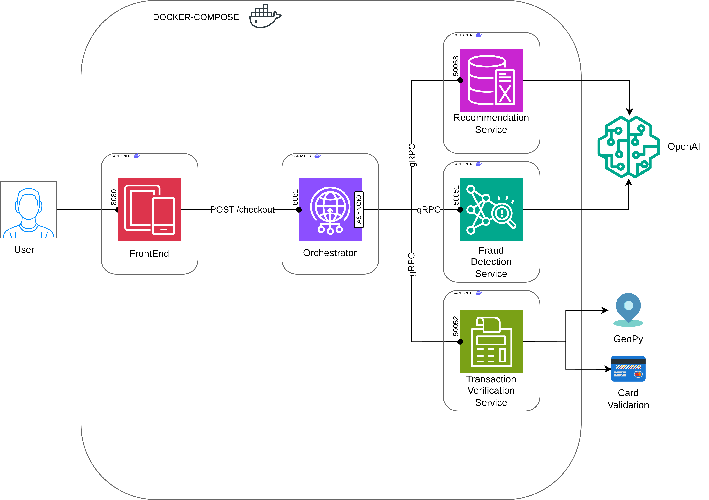
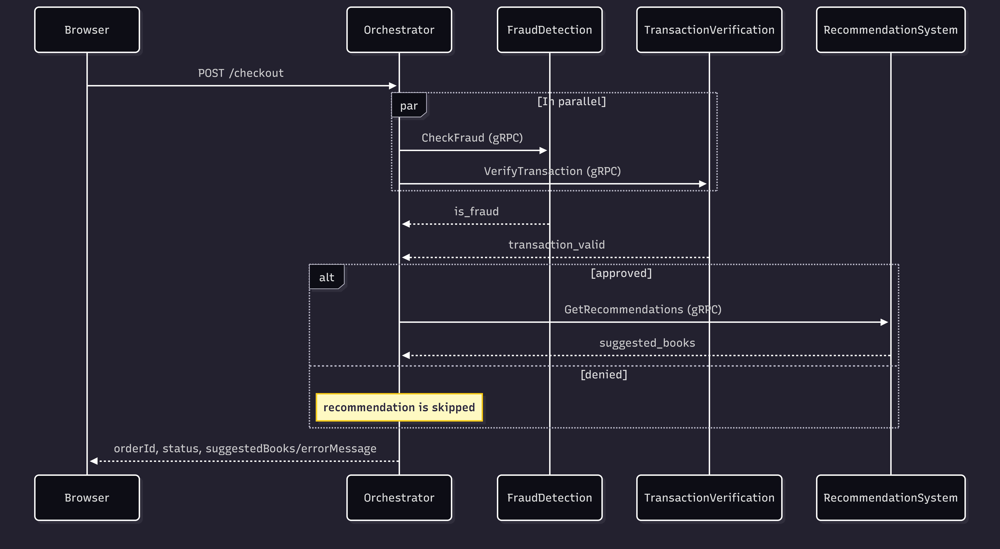

# Distributed Systems Project — Bookstore

**Team:** Yevhen Pankevych, Yehor Bachynsky, Merili Pihlak

This repository contains the code for the practice sessions of the Distributed Systems course at the University of Tartu.

## Overview

An online bookstore system composed of multiple microservices that communicate via **gRPC**, and have a general orchestrator with the REST API provided. When a user places an order through the frontend, the orchestrator concurrently invokes all backend services and returns a combined response.

### Architecture



### Services

| Service | Description | Port |
| --- | --- | --- |
| **Frontend** | Static HTML page, running in a Docker container, with the exposed port | REST `8080` |
| **Orchestrator** | Flask REST API to do checkout; orchestrates calls to all services via async gRPC | REST `8081` |
| **Fraud Detection** | Uses OpenAI to detect fraud orders (prompt injection, suspicious fields, etc.) | gRPC `50051` |
| **Transaction Verification** | Validates credit card number (Luhn's algorithm), card vendor (Visa/Mastercard), expiry date, billing address (validates address is real using GeoPy), and item list (items are not empty and do not exceed reasonable quantities) | gRPC `50052` |
| **Recommendation System** | Uses OpenAI to suggest books from the catalog based on the user's order | gRPC `50053` |

### gRPC Interfaces

Each service returns a response with the direct answer (is_fraud, is_valid, recommendations) and an optional error message if something went wrong. The orchestrator combines the responses and returns a single JSON object to the frontend.

Methods:
- `FraudDetectionService.CheckFraud(FraudRequest(user, credit_card, user_comment, List(item), billing_address, shipping_method, gift_wrapping, terms_accepted))` -> `FraudResponse(is_fraud, error_message)`
- `TransactionVerificationService.VerifyTransaction(TransactionVerificationRequest(credit_card, List(item), billing_address))` -> `TransactionVerficationResponse(is_valid, error_message)`
- `RecommendationService.GetRecommendations(RecommendationRequest(user_comment, List(item)), top_k))` -> `RecommendationResponse(suggested_books, error_message)`



## Prerequisites

- Docker & Docker Compose
- An OpenAI API key

## Running

### Generate gRPC Stubs

```bash
python recompile_proto.py
```

### Run the system

```bash
export OPENAI_API_KEY=<api-key>
export OPENAI_MODEL=<model-name>
docker compose up --build
```

### Visit UI

Navigate to [http://localhost:8080](http://localhost:8080) in the browser.

## Logs

Each service uses python `logging` library to write structured logs to the `logs/` directory (volume-mounted into every container) and into the console. Each service creates own log file with the name `<ServiceName>.log` in the `logs/` directory.
