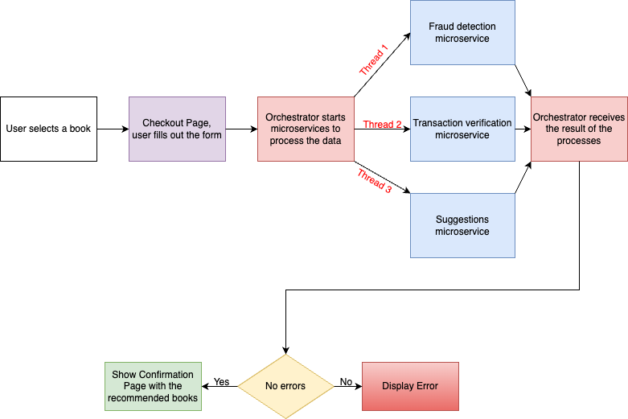

# Checkpoint 1

This folder should contain your documentation, explaining the structure and content of your project. It should also contain your diagrams, explaining the architecture. The recommended writing format is Markdown.

# Online Bookstore System Documentation

1. **Visit Main Page:**

   - Users enter the online bookstore through the main page, where they can explore extensive collection of books

2. **Book Selection:**

   - Upon finding a desired book, users select the book and indicate the desired quantity on the product page.

3. **Checkout Process:**

   - Users proceed to the checkout form to finalize their purchase. This step involves providing necessary details for the order.

4. **Submission:**

   - After completing the checkout form, users submit their order. This triggers the orchestrator to initiate backend services.

5. **Orchestrator and Services:**

   - The orchestrator calls upon various services using 3 threads per service to perform their respective tasks:
     - **Fraud Detection Service:** Analyzes transactions to identify and prevent fraudulent activities.
     - **Suggestions Service:** Recommends additional books based on purchase.
     - **Transaction Verification Service:** Verifies the accuracy and integrity of the transaction data.

6. **Outcome Handling:**
   - If the services successfully execute their tasks, the system proceeds to recommend additional books based on the user's preferences.
   - In case of any errors during execution, the system displays an error message to guide users on how to proceed.

## Recommendations and Confirmation

- **Successful Transaction:**

  - Users receive recommendations for additional books based on their purchase history and preferences.
  - A confirmation message acknowledges the successful checkout.

- **Error Handling:**
  - In the event of an error, users are promptly notified through a user-friendly error message. The system guides users on resolving the issue to ensure a smooth experience.

## Health Endpoint for Admin

- When the administrator visits the health endpoint, the orchestrator initiates the health check process by creating three threads to monitor the status of the services.

  - **Thread 1: Inventory Management Service Health Check**

    - The first thread assesses the health of the Fraud Detection Service.

  - **Thread 2: Payment Processing Service Health Check**

    - The second thread evaluates the health status of the Suggestions Service.

  - **Thread 3: Additional Services Health Check**
    - The third thread checks the status of the Transaction Verification Service.

- If all three threads successfully confirm that the services are running and healthy, the orchestrator generates a JSON object indicating that the overall state of the services is healthy.

- In the event that any of the threads detects an issue or if a service is not running, the JSON object will reflect that the system is not in a healthy state.

