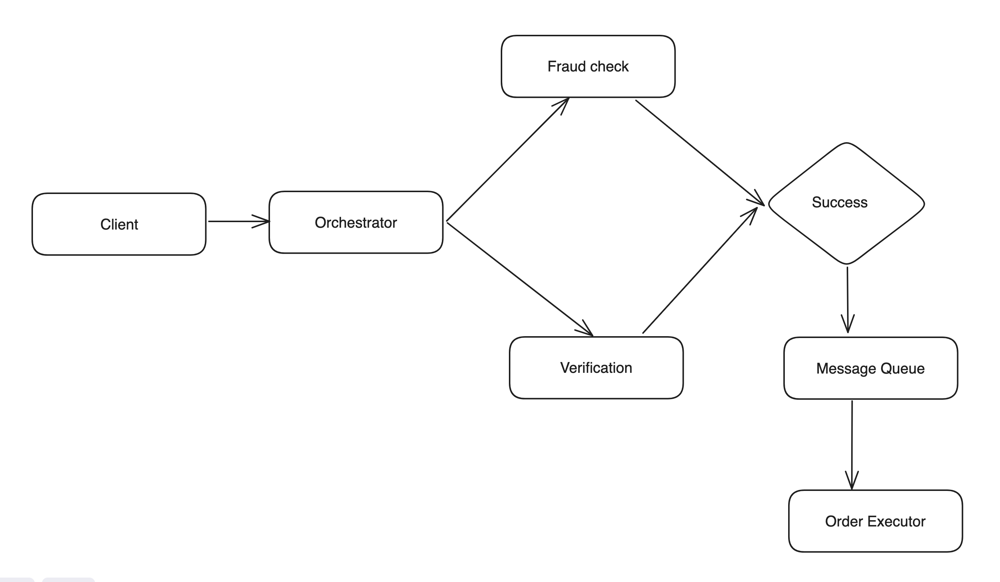
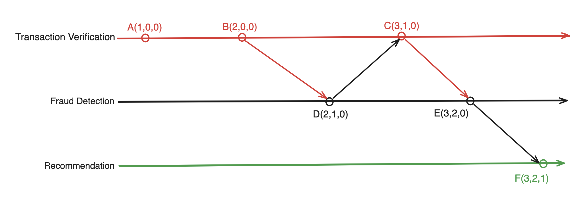
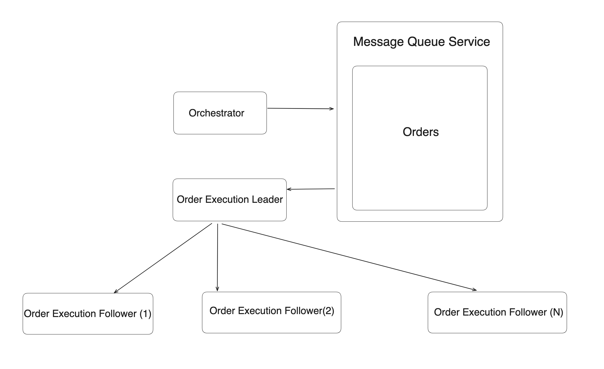
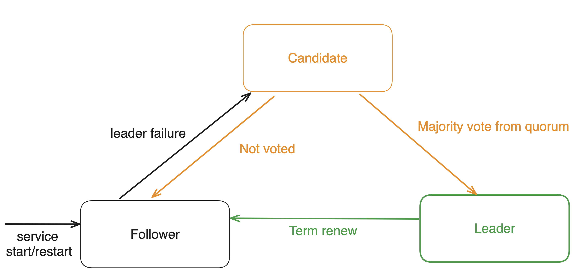

# Checkpoint 2

## Order Processing

1. **Order Submission:**

   - Users submit their order through the checkout form, which triggers the orchestrator to initiate backend services.

2. **Orchestrator and Services:**

   - The orchestrator calls various services to perform their respective tasks:
     - **Fraud Detection Service:** Analyzes transactions to identify and prevent fraudulent activities.
     - **Transaction Verification Service:** Verifies the integrity of the transaction data.
     - **Order Queue Service:** Manages the order queue.
     - **Suggestions Service:** Recommends additional books based on purchase.

3. **Outcome Handling:**
 
   - If the services successfully execute their tasks, the system proceeds to recommend additional books based on the user's preferences.
   - In case of any errors during execution, the system returns an error message.

High-Level Diagram of Order Processing:

## Event Ordering & Vector Clocks

To ensure consistency and ordering of events across services, we use vector clocks. Each service maintains its vector clock, which is updated whenever an event occurs. The vector clock is used to determine the order of events and resolve conflicts. The vector clock enforces the following event ordering rules:

A. transaction-verification service verifies if the order items (books) are not an empty list. \
B. transaction-verification service verifies if the mandatory user data (name, contact, address…) is all filled in. \
C. transaction-verification service verifies if the credit card information is in the correct format. \
D. fraud-detection service checks the user data for fraud. \
E. fraud-detection service checks the credit card data for fraud. \
F. suggestions service generates book suggestions. 

Sequence of events: A -> B , B -> D , D -> C , C -> E , E -> F

Vector Clocks Diagram:

## Order Queue Service

Order queue service manages the incoming orders and makes them available to order executor services. An order is enqueued by the orchestrator when a user submits an order. After, order is successfully enqueued a leader order executor service consumes the order from the queue and processes it. 

Order Queue Service Diagram:

## Leader Election

The leader election process is inspired by the Raft consensus algorithm. All order executors know about each other.Initially, all order executors are in the follower state. When an order executor detects that the leader is down or not available, it starts an election process. The order executor that wins the election becomes the leader and starts processing orders.

**Leader election steps:**

1. Order executor service starts as a follower, and with current **TERM**(the default value is 0).
2. It checks if leader information is available, periodically(with randomly varying interval) sends a heartbeat to the leader.
3. If the leader is not available, it starts an election process.
4. The service promotes it self to **CANDIDATE** increments the **TERM** by 1.
5. As with any good election the service votes for it self, and sends a votes-me request to all other order executors.
6. Other order executors validate the request and vote for the candidate if they have not voted for any other candidate in the current term.
7. If the candidate receives votes from the majority of the order executors, it becomes the leader.

Leader Election Diagram:

Once the leader is elected it starts processing the orders from the order queue, and it also replicates the order queue to other order executors. If the leader goes down, one of the followers starts election process again, and a new leader is elected.
